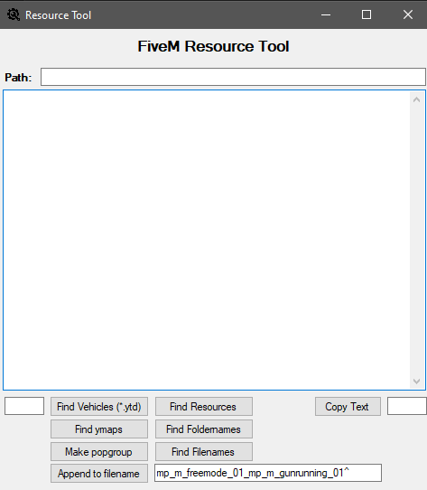

# ResourceTool

|               Screenshot                  |
|                :---:                      |
|               |

A tool for vMenu to help add multiple vehicles to addons.json

1. Run ResourceTool.exe
2. Set Path - Paste full directory path to [anything related] in top textbox.
3. Click a button.
4. Click Copy Text button to copy.

- Open addons.json and paste the text in "vehicles" for vehicle names.
- Appends names to EUP files in an instance.
- Find all resource names
- Find all filenames

Not a tool for anyone that doesn't know what they are doing. Be cautious, back up your files.
